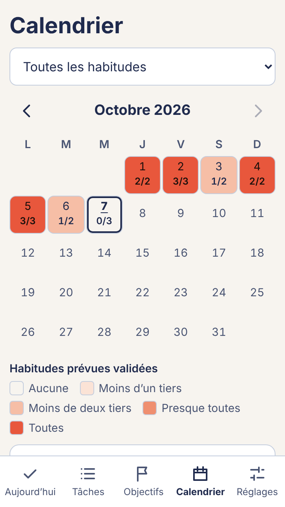
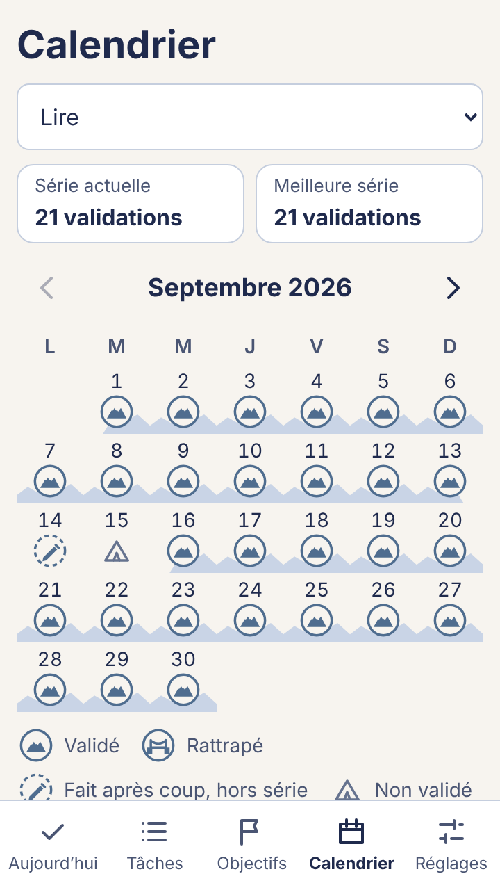
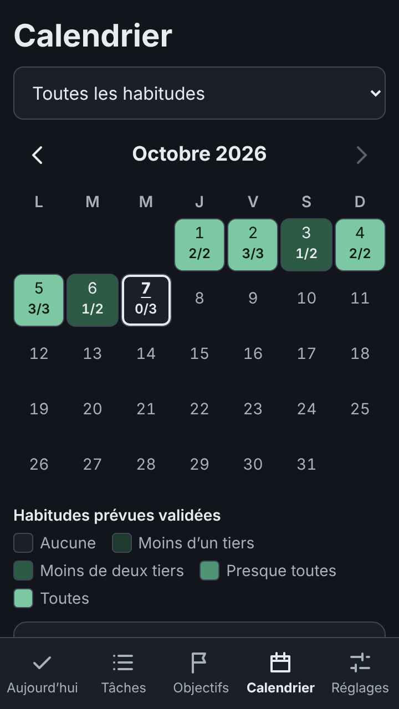

# Ascent (nom provisoire)

**Habitudes, tâches et objectifs dans une seule application : ouvrir, cocher, repartir en moins d'une minute.**
La gamification est un décor de montagne agréable, sans pression ni message culpabilisant.

Projet de portfolio product manager, de la vision à la mise en ligne.
👉 Essayer l'application : https://jovanniii.github.io/ascent-habits/ (installable sur téléphone, fonctionne hors ligne).

## Le problème

Les gens répartissent leurs tâches, leurs habitudes et leurs objectifs dans plusieurs outils (notes, agendas, applications de suivi) et finissent par abandonner, faute de vue d'ensemble et de motivation visuelle. Les applications d'habitudes existantes misent souvent sur la pression : séries remises à zéro, notifications insistantes, messages culpabilisants.

## La vision

Une seule application pour cocher en 30 secondes ses habitudes, ses tâches et ses objectifs, dans un univers visuel qui donne envie de l'ouvrir.

- **Habitude** : récurrente, sans fin, avec une série et des paliers (21 jours, 2 mois, 6 mois, 1 an).
- **Tâche** : ponctuelle, elle disparaît une fois faite.
- **Objectif** : une destination, avec des jalons qu'on peut ajouter ou modifier en route.
- **Calendrier** : une carte de chaleur des jours accomplis et, pour chaque habitude, ses séries ; un jour passé peut être noté « fait après coup », sans effet sur la série.

Chaque habitude du jour s'affiche dans un petit panorama où un alpiniste progresse vers le prochain palier.

## Les choix assumés

- **La rapidité avant tout** : un toucher pour cocher, l'écran « Aujourd'hui » montre tout ce qui compte.
- **Aucune culpabilisation** : un jour manqué se rattrape le lendemain (une fois par semaine) ; aucun message négatif, aucune pénalité.
- **La gamification comme décor**, pas comme levier de rétention : pas de classement, pas de réseau social, pas de notification par défaut.
- **Les données restent sur l'appareil** : aucun compte, aucun serveur, export et import manuels.
- **Mesure sans surveillance** : aucun outil d'analyse tiers ; les testeurs envoient volontairement un fichier de statistiques anonymes, sans aucun texte saisi.
- **Moteur et habillage séparés** : la montagne est un thème parmi d'autres à venir (ciel, port, désert, fond marin).
- **Accessible** : contrastes vérifiés, tailles tactiles, lecteurs d'écran, réduction des animations.

Chaque arbitrage est consigné, avec les alternatives écartées, dans le [journal de décisions](docs/journal-decisions.md).

## Captures d'écran

> Section réservée : captures définitives à ajouter (téléphone, thème Montagne et thème Sobre, clair et sombre).

| Aujourd'hui | Objectifs | Réglages |
| --- | --- | --- |
| *(capture à venir)* | *(capture à venir)* | *(capture à venir)* |

Calendrier (itération 3, 360 × 640) :

| Vue globale, Montagne | Vue par habitude, Montagne | Vue globale, Sobre sombre |
| --- | --- | --- |
|  |  |  |

Toutes les captures de l'itération 3 : [docs/captures/iteration-3/](docs/captures/iteration-3/).

## Lancer le projet

Prérequis : Node.js 22.18 ou plus récent.

```bash
npm ci
npm run dev        # http://localhost:5173/ascent-habits/
```

| Script | Rôle |
| --- | --- |
| `npm run dev` | Serveur de développement |
| `npm test` | Tests unitaires et d'interface (Vitest) |
| `npm run test:coverage` | Tests avec couverture du moteur, du stockage et des thèmes |
| `npm run test:e2e` | Parcours de bout en bout, accessibilité (axe) et PWA (Playwright, téléphone et tablette) |
| `npm run lighthouse` | Lighthouse sur le build de production (lancer `npm run build` avant) |
| `npm run lint` | ESLint |
| `npm run typecheck` | Vérification TypeScript |
| `npm run build` | Build de production dans `dist/` |
| `npm run preview` | Sert le build de production localement |
| `npm run stats:analyse -- <dossier>` | Analyse des fichiers de statistiques anonymes reçus (tableau Markdown) |
| `npm run icons` | Régénère les icônes PWA depuis `public/favicon.svg` |
| `npm run assets:optimize` | Optimise les illustrations SVG du thème montagne (`assets:check` pour vérifier sans modifier) |
| `npm run check:budget` | Vérifie le budget de poids du build (JavaScript, CSS, polices, illustrations) |

Avant le premier `npm run test:e2e` : `npx playwright install chromium`.

### Qualité automatisée

À chaque pull request :

- **CI** (`.github/workflows/ci.yml`) : lint, types, tests avec seuils de couverture, build, illustrations optimisées et budget de poids.
- **Qualité** (`.github/workflows/qualite.yml`) :
  - parcours clés sur téléphone et tablette simulés (créer, cocher et annuler une habitude, tâche, objectif avec jalons, thème, export puis import, rechargement) ;
  - axe sur chaque écran, dans chaque thème, en clair et en sombre : aucune violation tolérée ;
  - manifeste PWA et fonctionnement hors ligne ;
  - Lighthouse : performance ≥ 0,90, accessibilité ≥ 0,95, bonnes pratiques ≥ 0,90 (seuils détaillés dans P6-D4).

## Architecture

```
src/
  engine/     Moteur : modèle, règles métier et commandes, en TypeScript pur
  storage/    Stockage abstrait (localStorage), validation, export/import, statistiques anonymes
  themes/     Thèmes interchangeables : contrat, registre, « mountain » et « plain » (sobre)
  ui/         Interface React (écrans, composants, état)
tests/        Tests de bout en bout (Playwright) et configuration Lighthouse
scripts/      Analyse des statistiques anonymes
```

- Le moteur ne dépend ni de React, ni du stockage, ni des thèmes, ni du navigateur (règle ESLint et test garde-fou).
- Les séries, la récupération, les paliers, le calendrier et la progression des objectifs sont des fonctions pures testées.
- Un thème est un dossier `src/themes/<id>/` : jetons de couleur et, s'il le souhaite, une illustration. Aucune référence à la montagne en dehors de son dossier (vérifié par un test).

Stack : React, TypeScript, Vite, PWA (vite-plugin-pwa), Vitest, Playwright, déploiement GitHub Pages.

## Déploiement et installation

Le workflow `.github/workflows/deploy.yml` publie l'application sur GitHub Pages à chaque push sur `main` (réglage unique du dépôt : **Settings → Pages → Source : « GitHub Actions »**).

- **Android (Chrome)** : ouvrir l'adresse, puis menu ⋮ → « Installer l'application ».
- **iPhone (Safari)** : ouvrir l'adresse, puis Partager → « Sur l'écran d'accueil ».

Pensez à exporter régulièrement vos données depuis les Réglages.

## Documents

| Document | Contenu |
| --- | --- |
| [01 – Problème et vision](docs/01-probleme-vision.md) | Problème, personas, proposition de valeur, positionnement |
| [06 – Backlog du MVP](docs/06-backlog-mvp.md) | User stories et priorités (M, S, C, W), critères de réussite |
| [07 – Direction artistique Montagne](docs/07-direction-artistique-montagne.md) | Intention, principes, palette, animations du thème pilote |
| [Brief d'illustration](docs/brief-assets.md) | Commande des illustrations du thème Montagne : liste des fichiers, contraintes, livraison |
| [Pipeline d'assets](docs/pipeline-assets.md) | Comment livrer les illustrations sans toucher au code, et budget de performance |
| [Journal de décisions](docs/journal-decisions.md) | Chaque arbitrage, ses alternatives et sa raison |
| [Protocole de test utilisateur](docs/protocole-test-utilisateur.md) | Test de 15 minutes sur téléphone, consentement, grille d'observation, vérifications d'accessibilité manuelles |
| [Étude de cas](docs/etude-de-cas.md) | Squelette de l'étude de cas produit : problème, décisions, métriques, résultats, apprentissages |
